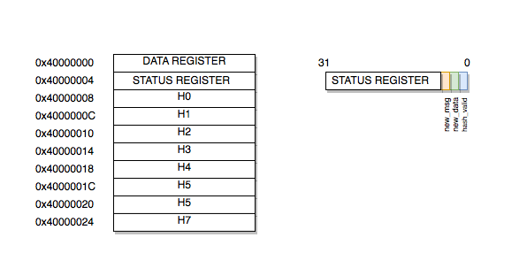
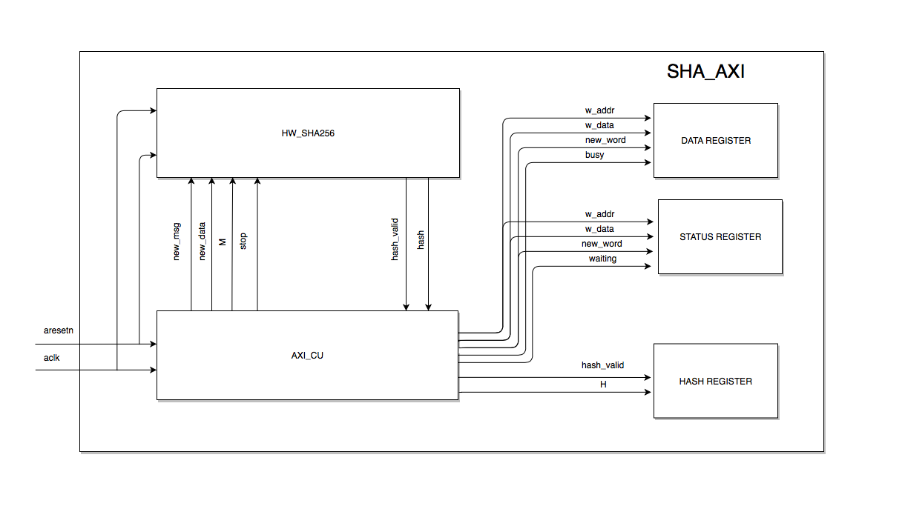
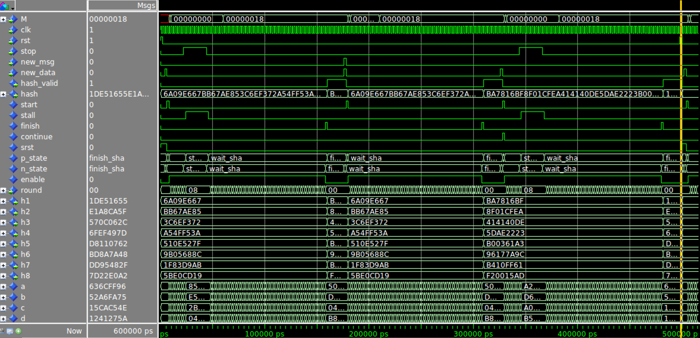
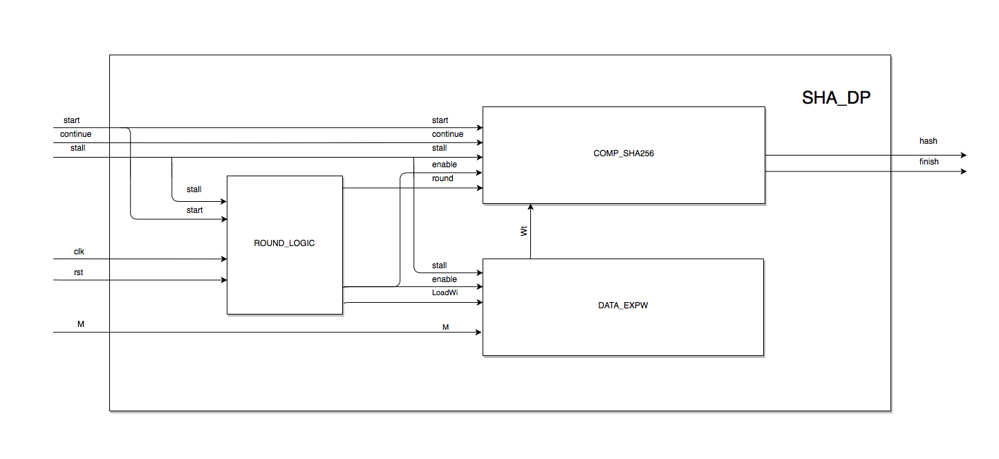
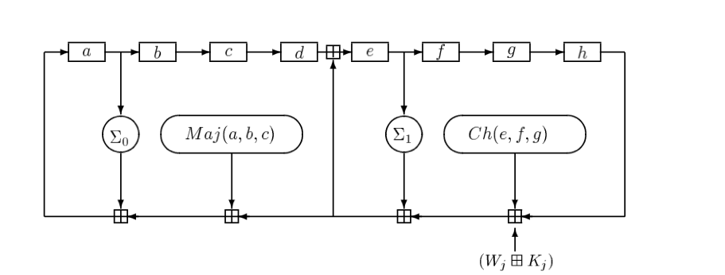
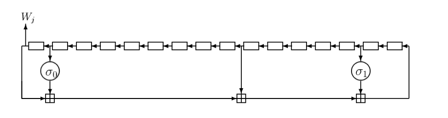
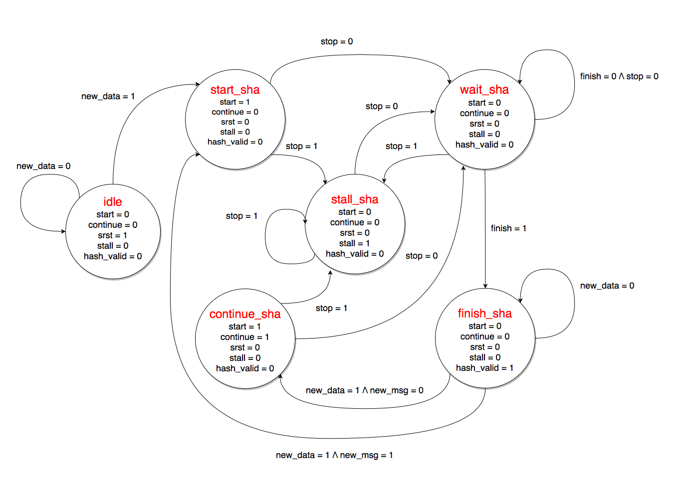

# DigitalSystems - SHA256 Hardware Accelerator Report

* [Introduction](#introduction)
* [Specification](#specification)
  + [Hardware](#hardware)
  + [Software](#software)
* [Design](#design)
  + [Top Entity](#top-entity)
  + [SHA256 unit](#sha256-unit)
    - [SHA256 datapath](#sha256-datapath)
      * [SHA256 compression function](#sha256-compression-function)
      * [SHA256 expansion unit](#sha256-expansion-unit)
    - [SHA256 control unit](#sha256-control-unit)
* [Synthesis](#synthesis)
  + [Timing Reports](#timing-reports)
    - [Area Reports](#area-reports)
    - [Synthesis Optimization](#synthesis-optimization)
* [Driver](#driver)
* [User interface](#user-interface)
* [Test](#test)

## Introduction

The aim of this project is to create a SHA256 hardware accelerator that will be mapped on the `Xilinx` core of the `Zybo` prototyping board. A `AXI Lite` compliant wrapper will be also designed to implement the communication between the processor and the peripheral. In the end we will create a GNU/Linux driver and a very simple user interface program to test the design on the board.\\

## Specification

None specifications were provided for the project so the one listed here are the result of choices made during both the hardware and software design phase.

### Hardware

The peripheral is designed to implement the basic SHA256 algorithm over 65 consecutive rounds. The message to hash must be split by the application in 16 words of 32 bits each and sent to the device through an `AXI Lite` compliant master. They have to follow the original order of the message and be packed according to the SHA256 standard. For example the "abc" must be split and sent with the following order
```
    M0          M1              M15

0x61626380  0x00000000  .... 0x00000018

```
The peripheral is designed as an `AXI slave` and it has 10 registers of 32 bits as shown in the picture




* `data_register` contains the `M` word of the message used by the algorithm for the computation of the hash during the current round. It is written by the ARM processor and read by the hardware block.

* `status_register` stores the control flags of the peripheral `new_msg`, `new_data` and the `hash_valid` bit to signal the end of the hash operation.
  * `status_register(2) = new_msg` is used to signal the begin of a new message to the hardware device. The `h0..h7` registers are initialize to the start values as specified by the SHA256 standard. If it is zero the new block is considered as part of the previous message and the hash algorithm continues with the current value of the `h` registers.
  * `status_register(1) = new_data` is used to signal the presence of a new block to hash. It is read by the hardware block and used as start signal for the algorithm.
  * `status_register(0) = hash_valid` is used to signal that a valid hash for the current block has been stored in the `H0..H7` registers. It is written by the hardware block and read by the processor. Every write attempt to this bit will be discarded by the control logic of the `AXI wrapper`.
Both `new_msg` and `new_data` are set to zero by the hardware block as soon as the start condition is detected. They can be modified during the execution of the algorithm but the effects of the operations are discarded until the next `hash_valid` condition is reached.


* `H0..H7` store the computed hash value for the current block. They are `read-only` registers and they can be modified only by the hardware block, all the write attempts will produce an `AXI error` message on the bus.


### Software

The software must be able to read a message from the `stdin` and sent it to the peripheral through the driver module loaded in the kernel of the `Zybo` board. The length of the message is not given and must be handle by the program at run time. Each message must be split in blocks according to the SHA256 standard.\\
The message is considered concluded when the user insert a `\n`. All the read and write operations to the peripheral must be 32 bits wide. The application must follow this scheme

  1. Acquire the message from the keyboard and split it in 32 bit words according to the SHA256 standard.
  2. Write to the `status_register` to signal that a new message needs to be hashed.
  3. Write in the `data_regsiter` the words that compose the first block of the message.
  4. Read the `status_register` to check when the peripheral has produced a valid hash.
  5. If there are still some blocks to hash write to the `status_register` to signal that a new block is available.
  6. Repeat 3 to 5 until all the blocks have been processed.
  7. Read the hash of the message from the `H0`, `H1`,`H2`, `H3`, `H4`, `H5`, `H6`, `H7` registers.


## Design

The whole peripheral has been built in a hierarchical way with a series of modules from the simplest to the top level represented by the `AXI wrapper`.


### Top Entity

The block diagram of the top entity [sha_axi.vhd](vhdl/sha_axi.vhd) is the following



As we can see it is structured in three main parts

  * `hw_sha256` contains the control unit and the datapath of the SHA256 hardware accelerator. It is connected to the external start signal represented by `new_data` and `new_msg`. If on the rising edge of the clock both the inputs are asserted the device starts the hash algorithm with `M` as first word of a new message. Instead if `new_msg` is low the current `M` is consider as part of a block of a previous message. In this second case the `h1..h7` internal registers are initialize to the current hash value, instead of the starting one defined by the standard. When the device finishes the computation on the current block `hash_valid` is asserted and the result is sent to the `hash` output. The `stop` input of the entity is the stall signal of `hw_sha256`, so as long as it remains high the whole chip is blocked.

  * `AXI_CU` manages the AXI communication between the peripheral and the processor. The addressable range now is form 0 to 79 and from 8 to 79 is read-only. It handles also all the control signals for the `hw_sha256` and the write logic for the `data_register`, `status_register` and the `H0..H7` registers. The most relevant signals in the design are the following
    * `stop` it stalls the execution of the SHA256 algorithm as soon as the `write_ctrl` process discovers that the next word `M`, required by the algorithm, is not yet present in the `data_register`. In order to identify this condition it checks if the `w_addr` points to an address of the data register and if a write operation is going to be performed on it with the `new_word` signal. Then after that all the 16 different parts of the block of the message have been received the process set `stop` to 0 in order to complete the remaining steps of the computation for which the external data is no more required. To recognize this condition a counter `cnt` is used and as soon as it reaches the value of 16 a `busy` signal is asserted to notify that the hardware accelerator is completing the last 48 steps required by the round logic. During this last phase all the write operations to the `data_register` will be accepted but will not modify the value of the register.

    * `waiting` it is used to avoid that the changes to the `status_register` occurred while the `hw_sha256` is computing the SHA256 of a block affect the final result in an unexpected way. As long as this signal is asserted the value of the bits 1 and 2 of the status register will not modify the `new_data` and `new_msg` controls. `waiting` and `busy` are set to zero during the first clock cycle in which `hash_valid` is high to notify that the hardware accelerator has finished to compute the hash for the current block.

  * `data_register`, `status_register` and `hash_register` contain respectively the next `M` word of the message that needs to be processed by the algorithm, the control parameters for the peripheral and the hash of the current block.

The testbench used for the component is [tb_sha256_axi.vhd](vhdl/testbench/tb_sha256_axi.vhd)

### SHA256 unit

It is the part of the peripheral responsible for the execution of the SHA256 algorithm. The vhdl file of the entity is [hw_sha256.vhd](vhdl/hw_sha256.vhd). As we can see it simply instantiates the datapath and the cu of the SHA256 device and links the control and data signals between the two.
These are the waveforms obtained form the simulation of the `hw_sha256`




#### SHA256 datapath

The vhdl file that codes the design is the following [sha256_dp.vhd](vhdl/sha256_dp.vhd).



As we can see it is split in there main parts
 * `comp_sha256` is the sub-module responsible for the execution of the compression function of the SHA256 algorithm.
 * `data_expW` performs the data expansion of the `M` input words of the massage to generate the 64 `W` required at each step of the round logic.
 * `round logic` handles all the control signals among one round of the algorithm. As soon as the `start` is detected on the rising edge of the clock the `enable` is asserted to start the first step of the SHA256. From now on at each clock cycle in which the `stall` is low and the `enable` is set, the next round of the computation will be performed and the `round` counter will be updated consequentially. As specified in the SHA256 standard during the first 16 steps of the algorithm the `W` words in the round logic are equal to the `M` one at the input and so the `LoadWi` signal must be set to 0. When the `round` counter reaches the value of 63 the `finish` signal is asserted, the count is reset and the `enable` is set to low until the next start condition is detected.

The `hash` changes continuously so the result must be considered valid only when the `finsh` signal is high.  

The testbench used for the component is [tb_sha256_dp.vhd](vhdl/testbench/tb_sha256_dp.vhd)

##### SHA256 compression function

The compression function is implemented in a straightforward from this block diagram



We only add some control signals to stall, reset and initialize the internal registers. Every time the `start` is asserted if `continue` is high then the registers `a`, `b`, `c`, `d`, `e`, `f`, `g` and `h` are initialized with the previous values of the hash `h1..h8`. When `finish` is set the last addition is performed and the valid hash for the block is sent to the output.

The testbench used for the component is [tb_comp_sha256.vhd](vhdl/testbench/tb_comp_sha256.vhd)


##### SHA256 expansion unit

The data expansion unit for the SHA256 is based on the following block diagram



Only the `enable` and `stall` signals are added to freeze the execution when the input word is not yet available.

The testbench used for the component is [tb_FIFO_expW.vhd](vhdl/testbench/tb_FIFO_expW.vhd)

#### SHA256 control unit

The vhdl description of the FSM for the SHA256 is in the file [sha256_fsm.vhd](vhdl/sha256_fsm.vhd).
The state diagram used to design the control unit is the following



* `idle` is the reset state of the machine and the control unit needs to drive the `srst` signal to reset also the datapath.

* `start_sha`: the `new_data` signal identifies a new block at the input that must be hashed by the peripheral. The `start` must be asserted to initialize the registers for the algorithm.

* `wait_sha`: the algorithm is executing at the `round` step. The machine remains in this state until either `finish` is asserted to signal the end of the computation or `stall` is set to 1 to freeze the execution, since the `M` word required is not yet available at the input.

* `stall_sha` all the internal registers are stalled until the `stop` signal is asserted.

* `continue_sha` is an alternative starting condition for the SHA256 algorithm. In this case the internal registers `h1..h8` of the compression function are not loaded to the standard initial values since the new block provided at the input is still a part of the previous message. The SHA256 algorithm needs to start with the previous value of `hash`.

* `finish_sha` is the hash valid state of the machine. On the output `hash` of the device the valid hash value for the block is provided.

The testbench used for the component is [tb_sha256_fsm.vhd](vhdl/testbench/tb_sha256_fsm.vhd)

## Synthesis

The script used for the synthesis is [sha256_axi_syn.tcl](scripts/sha256_axi_syn.tcl). Before synthesizing the circuit we need to define a variable to point the `sha256` directory
``` sh
sha256=path-to-sha256/sha256
vivado -mode batch -source $sha256/scripts/sha256_axi_syn.tcl -notrace -tclargs $sha256
```
We tried to set a frequency of 100 MHz for the synthesis, but a critical warning was generated because `Xilinx` was not able to respect the timing constraints. So we decided to decrease it to 50 MHz and relunch the synthesis procedure.

### Timing Reports
```
------------------------------------------------------------------------------------------------
| Clock Summary
| -------------
------------------------------------------------------------------------------------------------

Clock       Waveform(ns)       Period(ns)      Frequency(MHz)
-----       ------------       ----------      --------------
clk_fpga_0  {0.000 10.000}     20.000          50.000          

---------------------------------------------------------------------------------------------------
From Clock:  clk_fpga_0
  To Clock:  clk_fpga_0

Setup :            0  Failing Endpoints,  Worst Slack        6.891ns,  Total Violation        0.000ns
Hold  :            0  Failing Endpoints,  Worst Slack        0.065ns,  Total Violation        0.000ns
PW    :            0  Failing Endpoints,  Worst Slack        9.020ns,  Total Violation        0.000ns
---------------------------------------------------------------------------------------------------
```
The timing constraints are respected with a large slack and, as expected, the critical path passes through the computation of the sum for the `a` register that involves the addition of 7 elements in a single step.
```
Max Delay Paths
--------------------------------------------------------------------------------------
Slack (MET) :             6.891ns  (required time - arrival time)
  Source:                 top_i/sha256_axi/U0/sha256_hw/dp/data/W_reg[14][21]/C
                            (rising edge-triggered cell FDRE clocked by clk_fpga_0  {rise@0.000ns fall@10.000ns period=20.000ns})
  Destination:            top_i/sha256_axi/U0/sha256_hw/dp/comp/a_reg[24]/D
                            (rising edge-triggered cell FDRE clocked by clk_fpga_0  {rise@0.000ns fall@10.000ns period=20.000ns})
  Path Group:             clk_fpga_0
  Path Type:              Setup (Max at Slow Process Corner)
  Requirement:            20.000ns  (clk_fpga_0 rise@20.000ns - clk_fpga_0 rise@0.000ns)
  Data Path Delay:        12.663ns  (logic 5.130ns (40.510%)  route 7.533ns (59.490%))
  Logic Levels:           17  (CARRY4=8 LUT3=1 LUT4=1 LUT5=4 LUT6=3)
  Clock Path Skew:        -0.175ns (DCD - SCD + CPR)
    Destination Clock Delay (DCD):    2.672ns = ( 22.673 - 20.000 )
    Source Clock Delay      (SCD):    2.977ns
    Clock Pessimism Removal (CPR):    0.130ns
  Clock Uncertainty:      0.302ns  ((TSJ^2 + TIJ^2)^1/2 + DJ) / 2 + PE
    Total System Jitter     (TSJ):    0.071ns
    Total Input Jitter      (TIJ):    0.600ns
    Discrete Jitter          (DJ):    0.000ns
    Phase Error              (PE):    0.000ns

    Location             Delay type                Incr(ns)  Path(ns)    Netlist Resource(s)
  -------------------------------------------------------------------    -------------------
                         (clock clk_fpga_0 rise edge)
                                                      0.000     0.000 r  
    PS7_X0Y0             PS7                          0.000     0.000 r  top_i/ps7/inst/PS7_i/FCLKCLK[0]
                         net (fo=1, routed)           1.207     1.207    top_i/ps7/inst/FCLK_CLK_unbuffered[0]
    BUFGCTRL_X0Y15       BUFG (Prop_bufg_I_O)         0.101     1.308 r  top_i/ps7/inst/buffer_fclk_clk_0.FCLK_CLK_0_BUFG/O
                         net (fo=1674, routed)        1.669     2.977    top_i/sha256_axi/U0/sha256_hw/dp/data/aclk
    SLICE_X6Y30          FDRE                                         r  top_i/sha256_axi/U0/sha256_hw/dp/data/W_reg[14][21]/C
  -------------------------------------------------------------------    -------------------
    SLICE_X6Y30          FDRE (Prop_fdre_C_Q)         0.518     3.495 r  top_i/sha256_axi/U0/sha256_hw/dp/data/W_reg[14][21]/Q
                         net (fo=7, routed)           1.142     4.637    top_i/sha256_axi/U0/sha256_hw/dp/data/rot_r0_in[4]
    SLICE_X9Y32          LUT5 (Prop_lut5_I2_O)        0.154     4.791 r  top_i/sha256_axi/U0/sha256_hw/dp/data/sum3__2_carry__0_i_13/O
                         net (fo=2, routed)           0.831     5.622    top_i/sha256_axi/U0/sha256_hw/dp/data/sum3__2_carry__0_i_13_n_0
    SLICE_X4Y29          LUT5 (Prop_lut5_I0_O)        0.327     5.949 r  top_i/sha256_axi/U0/sha256_hw/dp/data/sum3__2_carry__0_i_3/O
                         net (fo=2, routed)           0.592     6.541    top_i/sha256_axi/U0/sha256_hw/dp/data/sum3__2_carry__0_i_3_n_0
    SLICE_X5Y29          LUT6 (Prop_lut6_I0_O)        0.124     6.665 r  top_i/sha256_axi/U0/sha256_hw/dp/data/sum3__2_carry__0_i_7/O
                         net (fo=1, routed)           0.000     6.665    top_i/sha256_axi/U0/sha256_hw/dp/data/sum3__2_carry__0_i_7_n_0
    SLICE_X5Y29          CARRY4 (Prop_carry4_S[1]_CO[3])
                                                      0.550     7.215 r  top_i/sha256_axi/U0/sha256_hw/dp/data/sum3__2_carry__0/CO[3]
                         net (fo=1, routed)           0.000     7.215    top_i/sha256_axi/U0/sha256_hw/dp/data/sum3__2_carry__0_n_0
    SLICE_X5Y30          CARRY4 (Prop_carry4_CI_O[0])
                                                      0.222     7.437 r  top_i/sha256_axi/U0/sha256_hw/dp/data/sum3__2_carry__1/O[0]
                         net (fo=1, routed)           1.188     8.625    top_i/sha256_axi/U0/sha256_hw/dp/data/sum3[8]
    SLICE_X7Y27          LUT3 (Prop_lut3_I0_O)        0.327     8.952 r  top_i/sha256_axi/U0/sha256_hw/dp/data/W[15][8]_i_1/O
                         net (fo=3, routed)           0.983     9.935    top_i/sha256_axi/U0/sha256_hw/dp/comp/D[8]
    SLICE_X7Y18          LUT5 (Prop_lut5_I1_O)        0.326    10.261 r  top_i/sha256_axi/U0/sha256_hw/dp/comp/sum3__94_carry__1_i_3/O
                         net (fo=2, routed)           0.449    10.710    top_i/sha256_axi/U0/sha256_hw/dp/comp/sum3__94_carry__1_i_3_n_0
    SLICE_X9Y20          LUT6 (Prop_lut6_I0_O)        0.124    10.834 r  top_i/sha256_axi/U0/sha256_hw/dp/comp/sum3__94_carry__1_i_7/O
                         net (fo=1, routed)           0.000    10.834    top_i/sha256_axi/U0/sha256_hw/dp/comp/sum3__94_carry__1_i_7_n_0
    SLICE_X9Y20          CARRY4 (Prop_carry4_S[1]_CO[3])
                                                      0.550    11.384 r  top_i/sha256_axi/U0/sha256_hw/dp/comp/sum3__94_carry__1/CO[3]
                         net (fo=1, routed)           0.000    11.384    top_i/sha256_axi/U0/sha256_hw/dp/comp/sum3__94_carry__1_n_0
    SLICE_X9Y21          CARRY4 (Prop_carry4_CI_CO[3])
                                                      0.114    11.498 r  top_i/sha256_axi/U0/sha256_hw/dp/comp/sum3__94_carry__2/CO[3]
                         net (fo=1, routed)           0.000    11.498    top_i/sha256_axi/U0/sha256_hw/dp/comp/sum3__94_carry__2_n_0
    SLICE_X9Y22          CARRY4 (Prop_carry4_CI_O[1])
                                                      0.334    11.832 r  top_i/sha256_axi/U0/sha256_hw/dp/comp/sum3__94_carry__3/O[1]
                         net (fo=4, routed)           1.150    12.982    top_i/sha256_axi/U0/sha256_hw/dp/comp/p_1_in[17]
    SLICE_X21Y21         LUT5 (Prop_lut5_I0_O)        0.303    13.285 r  top_i/sha256_axi/U0/sha256_hw/dp/comp/sum5__0_carry__3_i_2/O
                         net (fo=2, routed)           0.591    13.876    top_i/sha256_axi/U0/sha256_hw/dp/comp/sum5__0_carry__3_i_2_n_0
    SLICE_X19Y21         LUT6 (Prop_lut6_I0_O)        0.124    14.000 r  top_i/sha256_axi/U0/sha256_hw/dp/comp/sum5__0_carry__3_i_6/O
                         net (fo=1, routed)           0.000    14.000    top_i/sha256_axi/U0/sha256_hw/dp/comp/sum5__0_carry__3_i_6_n_0
    SLICE_X19Y21         CARRY4 (Prop_carry4_S[2]_CO[3])
                                                      0.398    14.398 r  top_i/sha256_axi/U0/sha256_hw/dp/comp/sum5__0_carry__3/CO[3]
                         net (fo=1, routed)           0.000    14.398    top_i/sha256_axi/U0/sha256_hw/dp/comp/sum5__0_carry__3_n_0
    SLICE_X19Y22         CARRY4 (Prop_carry4_CI_CO[3])
                                                      0.114    14.512 r  top_i/sha256_axi/U0/sha256_hw/dp/comp/sum5__0_carry__4/CO[3]
                         net (fo=1, routed)           0.000    14.512    top_i/sha256_axi/U0/sha256_hw/dp/comp/sum5__0_carry__4_n_0
    SLICE_X19Y23         CARRY4 (Prop_carry4_CI_O[0])
                                                      0.222    14.734 r  top_i/sha256_axi/U0/sha256_hw/dp/comp/sum5__0_carry__5/O[0]
                         net (fo=1, routed)           0.608    15.341    top_i/sha256_axi/U0/sha256_hw/cu/sum5[12]
    SLICE_X22Y23         LUT4 (Prop_lut4_I3_O)        0.299    15.640 r  top_i/sha256_axi/U0/sha256_hw/cu/a[24]_i_1/O
                         net (fo=1, routed)           0.000    15.640    top_i/sha256_axi/U0/sha256_hw/dp/comp/h1_in_reg[31]_0[12]
    SLICE_X22Y23         FDRE                                         r  top_i/sha256_axi/U0/sha256_hw/dp/comp/a_reg[24]/D
  -------------------------------------------------------------------    -------------------

                         (clock clk_fpga_0 rise edge)
                                                     20.000    20.000 r  
    PS7_X0Y0             PS7                          0.000    20.000 r  top_i/ps7/inst/PS7_i/FCLKCLK[0]
                         net (fo=1, routed)           1.101    21.101    top_i/ps7/inst/FCLK_CLK_unbuffered[0]
    BUFGCTRL_X0Y15       BUFG (Prop_bufg_I_O)         0.091    21.192 r  top_i/ps7/inst/buffer_fclk_clk_0.FCLK_CLK_0_BUFG/O
                         net (fo=1674, routed)        1.480    22.673    top_i/sha256_axi/U0/sha256_hw/dp/comp/aclk
    SLICE_X22Y23         FDRE                                         r  top_i/sha256_axi/U0/sha256_hw/dp/comp/a_reg[24]/C
                         clock pessimism              0.130    22.802    
                         clock uncertainty           -0.302    22.500    
    SLICE_X22Y23         FDRE (Setup_fdre_C_D)        0.031    22.531    top_i/sha256_axi/U0/sha256_hw/dp/comp/a_reg[24]
  -------------------------------------------------------------------
                         required time                         22.531    
                         arrival time                         -15.640    
  -------------------------------------------------------------------
                         slack                                  6.891    
```
To increase the speed of the synthesized designed we should introduce a pipeline stage to split this sum and reduce in this way the number of elements along the critical path within a single stage.

#### Area Reports

```
Report Cell Usage:
+------+-------+------+
|      |Cell   |Count |
+------+-------+------+
|1     |CARRY4 |   116|
|2     |LUT1   |    34|
|3     |LUT2   |   385|
|4     |LUT3   |   124|
|5     |LUT4   |   520|
|6     |LUT5   |   273|
|7     |LUT6   |   295|
|8     |SRL16E |    64|
|9     |FDRE   |   950|
|10    |FDSE   |   138|
|11    |LD     |    77|
+------+-------+------+
```
```
Report Instance Areas:
+------+--------------+------------+------+
|      |Instance      |Module      |Cells |
+------+--------------+------------+------+
|1     |top           |            |  2976|
|2     |  U0          |sha256_axi  |  2976|
|3     |    sha256_hw |hw_sha256   |  2240|
|4     |      cu      |sha256_fsm  |   102|
|5     |      dp      |sha256_dp   |  2138|
|6     |        comp  |comp_sha256 |  1583|
|7     |        data  |data_expW   |   532|
+------+--------------+------------+------+
```
```
Hierarchical RTL Component report
Module comp_sha256
Detailed RTL Component Info :
+---Adders :
	   5 Input     32 Bit       Adders := 1     
	   3 Input     32 Bit       Adders := 1     
+---XORs :
	   3 Input     32 Bit         XORs := 3     
	   2 Input     32 Bit         XORs := 1     
+---Registers :
	               32 Bit    Registers := 8     
+---Muxes :
	   2 Input     32 Bit        Muxes := 15    
	   2 Input      1 Bit        Muxes := 2  

Module data_expW
Detailed RTL Component Info :
+---Adders :
	   4 Input     32 Bit       Adders := 1     
+---XORs :
	   3 Input     32 Bit         XORs := 2     
+---Registers :
	               32 Bit    Registers := 16    
+---Muxes :
	   2 Input     32 Bit        Muxes := 1  

Module sha256_dp
Detailed RTL Component Info :
+---Adders :
	   2 Input      6 Bit       Adders := 1     
+---Registers :
	                6 Bit    Registers := 1     
	                1 Bit    Registers := 3     
+---Muxes :
	   2 Input      6 Bit        Muxes := 1     
	   2 Input      1 Bit        Muxes := 10   

Module sha256_fsm
Detailed RTL Component Info :
+---Muxes :
	  14 Input      3 Bit        Muxes := 1     
	   2 Input      1 Bit        Muxes := 1     
	   6 Input      1 Bit        Muxes := 6    

Module sha256_axi
Detailed RTL Component Info :
+---Registers :
	               32 Bit    Registers := 10    
	                3 Bit    Registers := 2     
	                1 Bit    Registers := 5     
+---Muxes :
	   2 Input     32 Bit        Muxes := 10    
	   4 Input     32 Bit        Muxes := 1     
	   2 Input      8 Bit        Muxes := 4     
	   2 Input      3 Bit        Muxes := 3     
	   7 Input      3 Bit        Muxes := 1     
	   6 Input      2 Bit        Muxes := 1     
	   2 Input      2 Bit        Muxes := 1     
	   4 Input      2 Bit        Muxes := 2     
	   3 Input      2 Bit        Muxes := 1     
	   3 Input      1 Bit        Muxes := 2     
	   2 Input      1 Bit        Muxes := 7     
	   4 Input      1 Bit        Muxes := 6     

```
#### Synthesis Optimization

I tried to synthesize the design with an higher clock frequency by changing the `freq` parameter in the synthesis script
``` tcl
set freq 95
set period [expr 1000.0 / $freq]
```
With this new value we still obtain a slack MET condition
```
------------------------------------------------------------------------------------------------
| Clock Summary
| -------------
------------------------------------------------------------------------------------------------

Clock       Waveform(ns)       Period(ns)      Frequency(MHz)
-----       ------------       ----------      --------------
clk_fpga_0  {0.000 5.500}      11.000          90.909          


Max Delay Paths
--------------------------------------------------------------------------------------
Slack (MET) :             0.255ns  (required time - arrival time)
  Source:                 top_i/sha256_axi/U0/sha256_hw/dp/data/W_reg[14][13]/C
                            (rising edge-triggered cell FDRE clocked by clk_fpga_0  {rise@0.000ns fall@5.500ns period=11.000ns})
  Destination:            top_i/sha256_axi/U0/sha256_hw/dp/comp/a_reg[29]/D
                            (rising edge-triggered cell FDRE clocked by clk_fpga_0  {rise@0.000ns fall@5.500ns period=11.000ns})
  Path Group:             clk_fpga_0
  Path Type:              Setup (Max at Slow Process Corner)
  Requirement:            11.000ns  (clk_fpga_0 rise@11.000ns - clk_fpga_0 rise@0.000ns)
  Data Path Delay:        10.492ns  (logic 4.726ns (45.044%)  route 5.766ns (54.956%))
  Logic Levels:           16  (CARRY4=9 LUT3=1 LUT4=1 LUT5=4 LUT6=1)
  Clock Path Skew:        -0.115ns (DCD - SCD + CPR)
    Destination Clock Delay (DCD):    2.677ns = ( 13.677 - 11.000 )
    Source Clock Delay      (SCD):    3.023ns
    Clock Pessimism Removal (CPR):    0.230ns
  Clock Uncertainty:      0.169ns  ((TSJ^2 + TIJ^2)^1/2 + DJ) / 2 + PE
    Total System Jitter     (TSJ):    0.071ns
    Total Input Jitter      (TIJ):    0.330ns
    Discrete Jitter          (DJ):    0.000ns
    Phase Error              (PE):    0.000ns
```

If we try to increase even more the frequency to 100 MHz a critical warning is risen to signal the violation of the timing constraints on the set up time in the critical path. For further optimizations we should rethink the architecture of our hardware accelerator.

## Driver

The driver [sha256_driver](C/sha256_driver.c) is based on the one already used for the DHT11 controller with only some slight changes to the write and read operations.

 * `sha256_read` it reads 4 bytes from the peripheral at the address pointed by `base_addr`+`f_pos`, where the former is defined during the synthesis to 0x40000000 and the latter must belong to the range 0 to 40. If the user application tries to read out of the bounds or requires more than 32 bits for each operation a read error is returned. To guarantee that the operation is completed before the return of the function a read memory barrier has been introduced before copying the buffer to the user space with `copy_to_user()`.

 * `sha256_write` in this operation the user can only write 32 bits at a time to the address pointed by `base_addr`+`f_pos`. Since all the `hash_register` are read-only the offset must be in the range 0 to 7 otherwise a write error is returned. Before writing to the peripheral the data must be copied from the user to the kernel space with `copy_form_user()`. A write memory barrier has been introduced to guarantee that the operation is completed before the return of the function.

 We need to change the makefile for the driver

 ``` sh
> echo 'obj-m := sha256_driver.o' > $tmp/C/Makefile
> cd $tmp/kernel
> make ARCH=arm M=$tmp/C modules
> make ARCH=arm M=$tmp/C INSTALL_MOD_PATH=$tmp/initramfs modules_install
 ```
## User interface

The user interface is coded in C in the file [sha256_user_interface.c](C/sha256_user_interface.c). It reads a message from `stdin` and prints the resulting hash on `stdout`. The program can be split in three main parts

1. Read from stdin the message
    ``` C
    printf("Enter the msg: ");
    while ((c = getchar()) != '\n') {
      buf[i] = c;
      i ++;
      if ((i % 64) == 63) { // reallocate the buffer every 64 chars
        chunks ++;
        i = chunks * 64 - 1;
        buf = (char *) realloc(buf, (chunks + 1) * 64 * sizeof(char));
        if (!buf) {
          printf("fail to reallocte memory for the buffer\n");
          exit(-1);
        }
      }
    }
    ```
   As first thing the program allocates a buffer of 64 bytes for the input message. Then it reads one char at a time and it increments a counter `len` each time a valid character is inserted. When the count reaches 63 it reallocates 64 more bytes of memory for the buffer. The whole procedure is repeated until a `\n` is read from the keyboard.

2. Generate the blocks that compose the message based on the SHA256 standard
  ``` C
  blocks = (len*8+64+1) / 512;
  ...
  for (i=0; i<len; i+=4) {
    for (j=0; j<3; j++) {
      M = M ^ buf[(i+j)];
      M = M << 8;
      read ++;
    }
    M = M ^ buf[(i+j)];
    read ++;
    msg_block[b][k] = M;
    M = 0;
    k++;
    if (k == 16) {
      k = 0;
      b ++;
    }
  }
  ```
 The program now identifies the number of blocks in which the message should fit. Then it starts to fill the generated blocks with the content of the buffer. Each one of these is made of 16 words of 32 bits according to the SHA256 standard.
  ``` C
  if (((len-56)%64) == 0) { // length of msg(56+64*k) need a new block only for '1' and padding
    M = ((M ^ one) << 24);
    msg_block[b][k] = M;
    msg_block[b][15] = 0;
    b ++;
    k = 0;
    M = 0;
  } else { // insert '1' and padding
    if ((len%4) != 0) { // the last M is not word alligned
      M = M ^ msg_block[b][k-1];
      M = (M | (one << ((4-(len%4)-1)*8)));
      msg_block[b][k-1] = M;
      M = 0;
    } else { // the last M is alligned
        M = 0;
        M = (M | (one << 24));
        msg_block[b][k] = M ;
        k++;
      }
    }
    ```
 If the length of the buffer is a multiple of 56 + K*64 then we need to fill the last block only with the padding and the length of the input message. Otherwise the application checks if the message's length is a multiple of 4 and in that case it simply appends a `1` at the begin of the next word. If not it inserts the `1` just after the last char in the last word of the current block and fills the remaining part with 0.
  ``` C
  M = 0;
  for (i=k; i<14; i++) { // insert padding
    msg_block[b][i] = M;
  }
  len = len*8;
  msg_block[b][14] = ((uint32_t*)&len)[1]; // insert the length of the buffer
  msg_block[b][15] = ((uint32_t*)&len)[0];
  ```
 In the end the length of the original input message is stored in the last two words of the block and the remaining ones are filled with padding.

3. Now the application can send the data required by the peripheral to hash the input message. As first thing it has to signal that a new block is available and to do so it performs a write to the `status_register` with the `new_msg` command. After that it starts to write the words of the blocks in the `data_register`
  ``` C
  for (i=0; i<(blocks+1); i++) {
    for (j=0; j<16; j++) {
      if (pwrite(fd, &(msg_block[i][j]), WORD, DATA_REG) < 4) {
        printf("fail to write to data reg msg_block[%d][%d]\n", i,j);
        exit (-1);
      }
    }
    if (i != blocks) {
      if((pwrite(fd, status, WORD, STATUS_REG)) < 4) {
        printf("fail to write to status reg new_block\n");
        exit (-1);
      }
    }
  }
  ```
Every 16 words a `new_data` command must be sent to signal the begin of a new block belonging to the same message of the previous one. When the application has finished to write the data it enters in a busy waiting loop until it reads 1 in the `hash_valid` bit of the `status_register`
  ``` C
  while (!finish) {
    if ((pread(fd, data, WORD, STATUS_REG)) < 4) {
      printf("fail to read from status reg\n");
      exit (-1);
    }
    if ((data[0] & 0x1) == 1) {
      finish = 1;
    } else {
      finish = 0;
    }
  }
  ```
In the end the 8 bytes of the hash are read from the `hash_register`
  ``` C
  for (i=0; i<8; i++) {
    if ((pread(fd, &(hash[i]), WORD, ((WORD*i)+H0_REG))) < 4) {
      printf("fail to read from hash[%d]\n",i);
      exit (-1);
    }
  }
  ```

## Test

To test the application on the board we need to cross-compile it and put the executable in the root filesystem uploaded on the board. To do so the following commands need to be performed
``` sh
> arm-linux-gnueabihf-gcc -o sha256_user_interface.o sha256_user_interface.c
> cp sha256_user_interface.o $tmp/initramfs/bin
> cd $tmp/initramfs
> find | fakeroot -i $tmp/fakeroot.lst cpio -o -H newc | gzip -c > $tmp/new_rootfs.cpio.gz
> mkimage -A arm -T ramdisk -C gzip -d $tmp/new_rootfs.cpio.gz $tmp/sdcard/uramdisk.image.gz
```
Now we have to copy the files in the SDCARD and boot the Zybo board. Then we have to launch `picocom` to connect to the board and load the kernel module
``` sh
picocom -b 115200 /dev/ttyUSB0
insmod /lib/modules/4.6.0-xilinx-dirty/extra/sha256_driver.ko
dht11> insmod /lib/modules/4.6.0-xilinx-dirty/extra/sha256_driver.ko
SHA256 module loaded.
SHA256 mapped at virtual address 0xe0964000
dht11> ls -l /dev/sha256
crw-------    1 root     root      244,   0 Jan  1 00:02 /dev/sha256
dht11> cat /proc/modules
sha256_driver 3102 0 - Live 0xbf000000 (O)
dht11> ls /sys/class/sha256
sha256
```
In the end we can launch the application located in the `bin` directory
``` sh
cd /bin
./sha256_user_interface
dht11> ./sha256_user_interface
Enter the msg: abc
Hash of msg: ba7816bf8f01cfea414140de5dae2223b00361a396177a9cb410ff61f20015ad
dht11> ./sha256_user_interface
Enter the msg: aaaaaaaaaaaaaaaaaaaaaaaaaaaaaaaaaaaaaaaaaaaaaaaaaaaaaaaa
Hash of msg: b35439a4ac6f0948b6d6f9e3c6af0f5f590ce20f1bde7090ef7970686ec6738a
```
If we try to remove the module and then use the application as expected we obtain an error
``` sh
dht11> rmmod sha256_driver
SHA256 module removed.
dht11> ./sha256_user_interface
fail to open /dev/sha256
```
